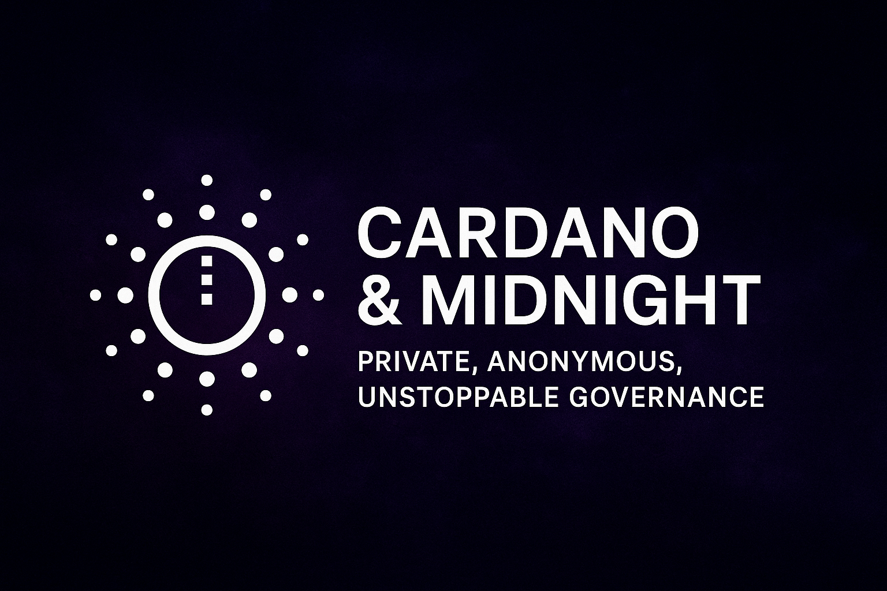

# Hello world

This document has been created to present a detailed solution for the project involving the exploration, research, development, and deployment of a Privacy voting solution for Cardano & Midnight.

<figure><figcaption></figcaption></figure>

Quick jump to our pre-production: [https://m9voting.netlify.app/](https://m9voting.netlify.app/)
