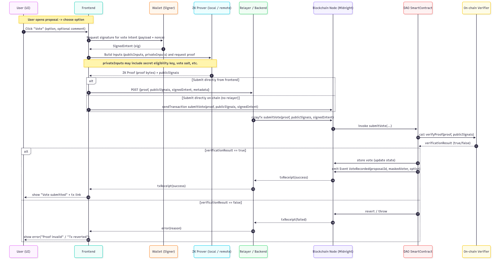

# Technical details

<figure><figcaption></figcaption></figure>

<figure><figcaption></figcaption></figure>

**Main Flow Explanation**:

**Initialize Session (vote-cli + vote-test-env):**

* Input parameters via CLI: commit/reveal duration, voter list.
* Mock Network is activated if the testnet encounters issues (addresses Risk #3).

**Commit Phase (vote-core):**

* Voters generate `hash(choice + salt)` and digitally sign it.
* The system verifies validity (signature, timing).
* Store the commit in storage (for later reveal).

**Reveal Phase (vote-core):**

* Voters submit their actual choice + salt.
* Verify that it matches the stored commit → only valid ballots are counted.
* _Note: No complex ZK-circuits are used (addresses Risk #2)._

**Aggregation & Documentation:**

* Results are output via vote-cli.
* All data structures and logic are recorded in vote-docs for reuse.

***

🛡️ **Risk Handling in the Architecture:**

* **Modularization** → Reduce dependency on the SDK (vote-core is separated from vote-test-env).
* **Mock Layer** → Enable offline testing independent of the testnet.
* **Simplified commit–reveal** → Avoid relying on Noir features that are not yet complete.
