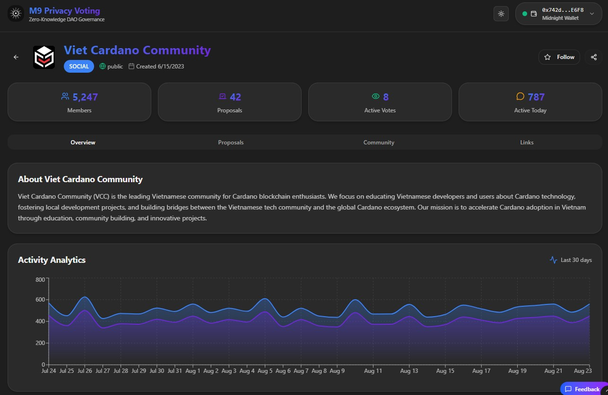
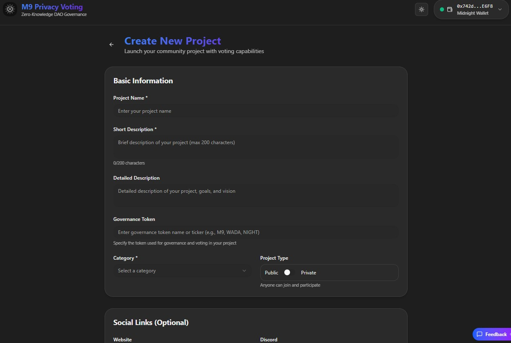

# Demo design

<figure><figcaption>
Proposals page
</figcaption></figure>

<figure><figcaption>
Proposals details page
</figcaption></figure>

<figure><figcaption>
Projects details page
</figcaption></figure>

<figure><figcaption>
Create project page
</figcaption></figure>

\

## 📌 Release Notes – M9 Privacy Voting dApp

**Version: 1.0**\
**Date:** \[add release date]

***

### 1.0.0.0 – Initial Release

* Core DAO voting dApp with ZK privacy and commit–reveal process.
* 8 main screens completed: Landing, Dashboard, Proposals, Voting, Results, Wallet, etc.

***

### 1.0.1.x – Navigation & Branding

* Added homepage with “Go to App” and “Docs”.
* Sidebar navigation for dashboard.
* Rebranded to **M9 Privacy Voting**.

***

### 1.0.2.x – Token System

* Replaced ADA → WADA.
* Added NIGHT as native token.
* Proposal templates updated with token options.

***

### 1.0.3.x – Stability Fixes

* Fixed proposal list/detail display issues.
* Improved voting proof flow.
* Fixed dialog accessibility warnings.

***

### 1.0.4.x – Wallet & Session

* Multi-wallet support: Midnight, Lace, Hydra.
* Wallet connection popup with address & session hash.
* Header dropdown with disconnect option.
* Guest mode access (limited features).

***

### 1.0.5.x – Proposals & Voting

* Expanded proposals dataset (+20).
* List/Grid toggle view.
* Proposal thresholds added.
* Enhanced results charts & analytics.

***

### 1.0.6.x – UI & Mobile

* Collapsible mobile sidebar.
* Global feedback button (Google Form, Telegram, Twitter).
* Responsive wallet popup (50% screen).
* Fixed demo notice modal warnings.

***

### 1.0.7.x – Documentation & Settings

* New Documentation page (GitBook, guides).
* Settings screen with Wallet, Privacy, Notifications, Appearance.
* Disconnect → return to homepage.

***

### 1.0.8.x – Projects & Community

* New **Projects & Community** module (20 projects).
* Detailed project pages with overview & analytics.
* Private projects: restricted proposal visibility.
* Featured projects: Viet Cardano Community & Vtechcom Lab.
* New governance token & visibility options in project creation.
